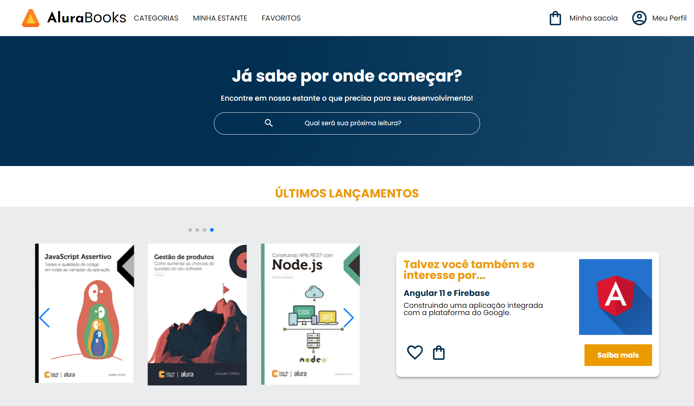

# Alura Books

Este é um projeto de website chamado **Alura Books** desenvolvido em HTML, CSS e JavaScript, criado para oferecer uma experiência de navegação agradável para os amantes de livros e entusiastas de leitura. O site apresenta uma ampla variedade de tópicos, desde programação até UX design, e traz as últimas novidades e best-sellers para os leitores ávidos.

## Funcionalidades

- **Exploração de Categorias**: Navegue por diversas categorias, incluindo Programação, Front-end, Infraestrutura, Business e Design & UX, para encontrar livros relacionados aos seus interesses.
- **Últimos Lançamentos e Mais Vendidos**: Descubra os últimos lançamentos e os livros mais vendidos em várias áreas.
- **Perfil do Autor**: Conheça os autores em destaque, incluindo informações sobre suas especialidades e obras.
- **Pesquisa Rápida**: Use a barra de pesquisa para encontrar rapidamente o livro que você está procurando.
- **Recursos Interativos**: Utilize carrosséis interativos para visualizar capas de livros e explore os detalhes dos títulos em destaque.

## Design Responsivo

Este site foi projetado para ser responsivo, o que significa que ele se adapta automaticamente a diferentes tamanhos de tela, tornando-o fácil de usar em dispositivos móveis e desktops.

## Tecnologias Utilizadas

- **HTML**: Estruturação do conteúdo da página.
- **CSS**: Estilização para criar um design moderno e responsivo.
- **JavaScript**: Integração de funcionalidades interativas como carrosséis de imagens.
- **Swiper.js**: Utilizado para criar carrosséis interativos e envolventes de forma fácil e eficaz.

## Como Visualizar o Site

Você pode acessar meu site pessoal [clicando aqui](https://projeto-plataforma-alura-books.vercel.app/).

## Contribuição

Se desejar contribuir para este projeto, sinta-se à vontade para criar issues, sugestões ou enviar pull requests. Todas as contribuições são bem-vindas!

## Autor

Gabriel Rios - Desenvolvedor

---

Obrigado por visitar meu repositório! Espero que tenha gostado do meu trabalho.
